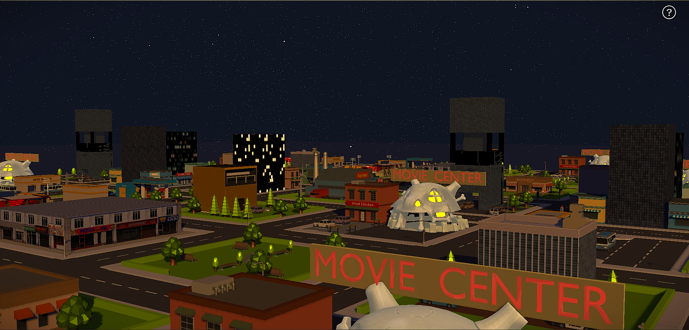

# 🌆 Infinity Town — Evening Weather Set  
A 3D Infinite Town Experience built using **Three.js**, featuring customizable Blender assets, realistic directional lighting & cloud system, thunderstorms and raining effects with dynamic shadow mapping, and reflective puddles across the roads.

<p align="center">
  
</p>


## 🚀 Overview
Infinity Town simulates a visually immersive 3D city that extends endlessly as the player moves forward.  
The environment blends handcrafted 3D assets with advanced lighting, weather and reflection effects to create an atmospheric evening urban world directly inside the browser.

<br>


## ✨ Key Features
- Customizable **Blender 3D assets** integrated into the scene.
- **Infinite city effect** through object recycling and movement logic.
- **Dynamic weather system** with clouds, thunderstorms & rainfall.
- **Directional lighting** that simulates realistic evening lighting.
- **Realtime shadow mapping** for buildings, streets and moving elements.
- **Reflective puddles** on the roads for added realism.
- Extended **render/view distance** for large-scale visibility.
- Optimized for stable performance in real-time rendering.


<br>


## 🛠️ How to Run the Project (Node & NPM)

1. Clone the repository
    ```sh 
    git clone <https://github.com/deepcodess/Infinity-Town.git>
    ```
2. Navigate to the folder
   ```sh
   cd infinity-town
   ```
3. Install dependencies
   ```sh
   npm install
   ```
4. Start the development server
    ```sh
    npm run dev
    ```

<br>


## 🛠️ How to Run the Project (Localhost – No npm required)

1. Clone the repository
   ```sh
   git clone <https://github.com/deepcodess/Infinity-Town.git>
2. Navigate to the folder
   ```sh
   cd infinity-town
3. Launch a local HTTP server via Live Server / Python / Node http-server
   
   **Python**
   ```sh
   python -m http.server 8080
   ```

    **or**
   ```sh
   py -m http.server 8080
    ```

    **Node http-server**
    ```sh
    npm install -g http-server

    http-server -p 8080
    ```


4. Open in browser:
   ```sh
    http://localhost:8080
    ```
   


<br>


## 🎬Demo Video

<p align="center">
  
</p>


<br>


## 🧠Development Contributions
- Created and optimized Blender 3D asset models for real-time rendering.
- Integrated assets into Three.js using GLTFLoader with accurate scaling and placement.
- Implemented dynamic weather system with clouds, rainfall & thunderstorms.
- Added directional lighting setup for evening ambiance.
- Enabled individual dynamic shadow maps for improved scene realism.
- Added reflective puddles using custom shader materials.
- Extended render range for expanded visible world.
- Optimized 3D assets and rendering logic for stable performance.
- Prepared report documentation describing the workflow, methodology, contribution and system features.
- Designed and updated the frontend UI elements using HTML & CSS for better user presentation.
- Created a project PPT for structured presentation and demonstration of the system.


<br>


## 📦 Tech Stack
| Technology | Purpose |
|-----------|---------|
| Three.js | 3D rendering & scene logic |
| Blender | 3D modeling & asset creation |
| JavaScript | Core logic & weather interactions |
| GLSL Shaders | Rain, reflection & light effects |
| GLTF/GLB | Asset loading format |


<br>

## 📜License
<p align="center">
  <a href="https://opensource.org/licenses/MIT">
    
  </a>
</p>
<p>
  This project is released under <strong>MIT License</strong>, allowing full permission to use, copy, modify, merge, publish, distribute, sublicense, and/or sell the software and its documentation — provided that the original copyright notice and this permission notice are included in all copies or substantial portions of the software.<br><br>
  THE SOFTWARE IS PROVIDED "AS IS", WITHOUT WARRANTY OF ANY KIND, EXPRESS ORIMPLIED, INCLUDING BUT NOT LIMITED TO THE WARRANTIES OF MERCHANTABILITY,FITNESS FOR A PARTICULAR PURPOSE AND NONINFRINGEMENT. IN NO EVENT SHALL THEAUTHORS OR COPYRIGHT HOLDERS BE LIABLE FOR ANY CLAIM, DAMAGES OR OTHERLIABILITY, WHETHER IN AN ACTION OF CONTRACT, TORT OR OTHERWISE, ARISING FROM,OUT OF OR IN CONNECTION WITH THE SOFTWARE OR THE USE OR OTHER DEALINGS IN THE SOFTWARE.
</p>


## 👥Credits
<a href="https://github.com/QwertyFusion">@DeepCodess</a>
<a href="https://github.com/Swarrrrovski">@Swarrrrovski</a>
<a href="https://github.com/MajumdarPreetam">@MajumdarPreetam</a>
<a href="https://github.com/SHREYASHIRAJ">@SHREYASHIRAJ</a>
<a href="https://github.com/rahull79">@rahull79</a>